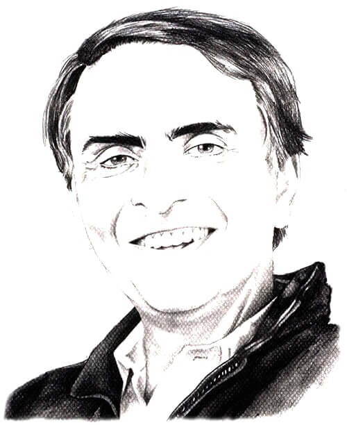
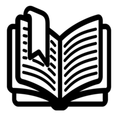

"A book is made from a tree. It is an assemblage of flat, flexible parts (still called "leaves") imprinted with dark pigmented squiggles. One glance at it and you hear the voice of another person, perhaps someone dead for thousands of years. Across the millennia, the author is speaking, clearly and silently, inside your head, directly to you. Writing is perhaps the greatest of human inventions, binding together people, citizens of distant epochs, who never knew one another. Books break the shackles of time ― proof that humans can work magic."

―&nbsp;Carl Sagan

<h2>About us</h2>

<strong>Enhance your Skill... Gain a Competitive Edge.</strong>

<a title="MyW3schools.com" href="http://www.myw3schools.com/">MyW3schools.com</a> is the internet's best source for Free, secure and fast eBook, Online Study Material and SRC downloads. Read and <code>download eBooks</code>, Online Study Material and <code>Source Codes</code> for Free: anywhere, anytime!

Collection includes:

<ul>
<li><code>Software directory</code> and Tutorial for beginners and professionals.</li>
<li>Great works of fiction, non-fiction and poetry, including works by Asimov, Jane Austen, Philip K. Dick, F. Scott Fitzgerald, Neil Gaiman, Tolstoy, Dostoevsky, Shakespeare, Ernest Hemingway, Virginia Woolf and James Joyce.</li>
<li>UPSC Prelims and Mains Indian History Notes, Best study material for CAT preparation, <code>Indian History </code>and Culture, Geography Notes, Indian and World Geography, Economics Notes - Indian Economy, Indian Polity Notes - Constitution, Social Justice, General Science Notes - Science and Technology, Environment Notes - Biodiversity, Climate.</li>
<li>Digital facsimiles of original documents by <code>Turing</code> and other pioneers of computing. Plus articles about Turing and his work, including Artificial Intelligence.</li>
</ul>

&nbsp;

<strong>Visit us at:</strong>

<ul>
<li class="about-us__description"><a href="http://www.myw3schools.com ">http://www.myw3schools.com </a></li>
<li class="about-us__description"><a href="https://manjunath5496.github.io ">https://manjunath5496.github.io</a></li>
</ul>

&nbsp;

<strong>Mail us at:</strong>

<ul>
<li class="about-us__description"><a href="mailto:info@myw3schools.com ">info@myw3schools.com </a></li>
<li class="about-us__description"><a href="mailto:myw3schools@gmail.com">myw3schools@gmail.com</a></li>
</ul>
